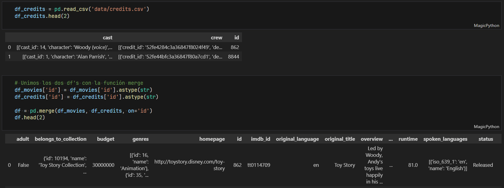
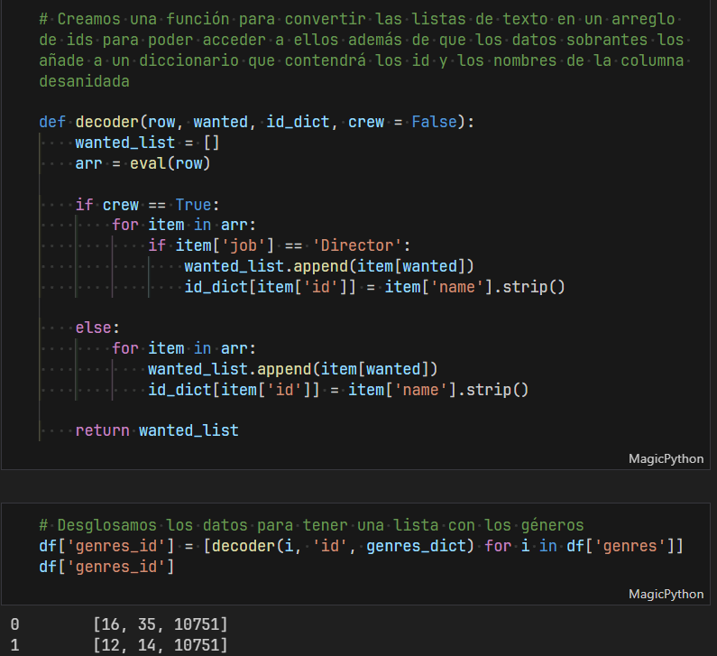
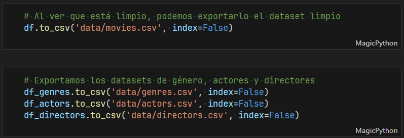
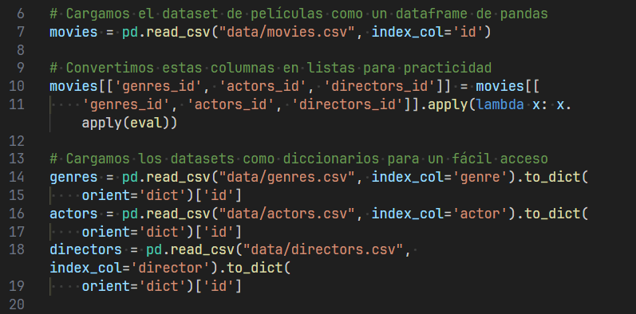
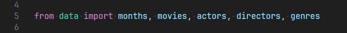
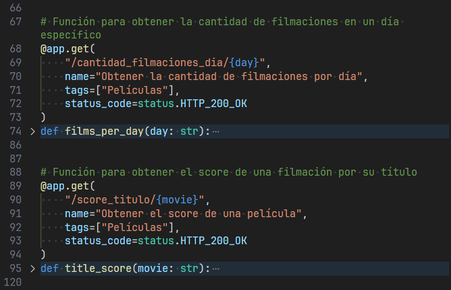
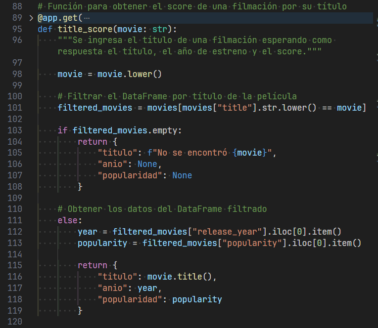
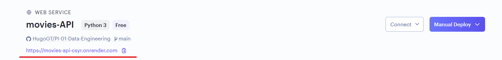

# <h1 align=center> **PROYECTO INDIVIDUAL N°1 CONSTRUYENDO UNA API** </h1>

_Autor: Hugo Gómez Tinoco_

Bienvenido! En este proyecto veremos como desplegar una API de películas para que una persona en cualquier parte del mundo pueda accedar a la misma. También se podrán ver los procesos de ETL(Limpieza de datos) y también un EDA(Análisis exploratorio de datos) para poder crear un modelo simple de recomendación de películas.

## **Índice**

- [Objetivos del proyecto](#objetivos-del-proyecto)
- [Desarrollo](#desarrollo)
  - [1) Extracción de los datos](#1-extracción-de-los-datos)
  - [2) Preparando el entorno](#2-preparando-el-entorno)
  - [3) Transformación](#3-transformación)
  - [4) Desanidando columnas](#4-desanidando-columnas)
  - [5) Exportando los datos](#5-exportando-los-datos)
  - [6) Leyendo los datos en FastAPI](#6-leyendo-los-datos-en-fastapi)
  - [7) Desarrollo de la API](#7-desarrollo-de-la-api)
  - [8) Deployment en Render](#8-deployment-en-render)
- [¿Te gustaría probar mi API?](#te-gustaría-probar-mi-api)
- [Tecnologías Utilizadas](#tecnologías-utilizadas)
- [Vídeos de referencia](#vídeos-de-referencia-para-fastapi)

## **Objetivos del proyecto**

- Descargar para realizar una _limpieza_ de datos desde dos _datasets_.
- Hacer las _transformaciones_ necesarias y unificar los _datasets_.
- _Expandir_ columnas anidadas.
- _Exportar_ los datos limpios.
- Crear los _endpoints_ para la API utilizando los datos limpios.
- _Desarrollar_ la API a través de la librería FastAPI.
- Hacer el _deploy_ de la API en Render.

## **Desarrollo**

### 1) Extracción de los datos

Para este proyecto se _utlizan credits.csv_ y _movies_dataset.csv_ los archivos se deben descargar desde este link:

- https://drive.google.com/drive/folders/1BnbBLuUP3vwN3H4suHThZf76xZPJORd8

Estos dos archivos deben ser ubicados en la carpeta data para así poder trabajar el ETL.

### 2) Preparando el entorno

Para que todo fluya en el entorno virtual tenemos que crear uno e instalar las librerías, los comandos son los siguientes:

- _py -m venv venv_ | Otras opciones pueden ser python o python3

Activamos el entorno con uno de estos tres comandos:

- _source venv/Scripts/activate_ | o
- _source venv\Scripts\activate_ | o
- _source venv/bin/activate_ | Linux y Mac

Por último se instalan las librerías necesarias para el proyecto:

- _pip install -r requirements.txt_

Con el entorno listo ya podemos empezar a trabajar

### 3) Transformación

Para el **ETL** se utiliza Python y la librería pandas.

- Código dentro del notebook: [ETL.ipynb](/ETL.ipynb)

### 4) Desanidando columnas

En los datos que nos mandaron hay columnas en las que nos vienen datos anidados, por lo cual se tuvieron que desanidar y extraer los datos que se necesesitaran para el desarrollo de la API y un posterior EDA.

### 5) Exportando los datos

Se exporta el _dataframe_ de las películas, así como otros tres csv que contienen el id de los actores, directores y género de las películas para la creación de la API.

### 6) Leyendo los datos en FastAPI

Para mantener el orden y la modularidad, se leen los datasets exportados en otro archivo, para que después FastAPI pueda utilizarlos en sus _endpoints_ desde el archivo _data.py_.

- Código de los datos: [data.py](/data.py)

- Importando en main.py:

### 7) Desarrollo de la API

Luego de importar los datos se crean los _endpoints_ con FastAPI

- Código de la API: [main.py](/main.py)

Se crean las funciones:

- films_per_month: Devuelve el total de filmaciones en un mes dado.
- films_per_day: Devuelve el total de filmaciones en un día dado.
- title_score: Devuelve la popularidad de una película dada.
- title_votes: Devuelve los votos totales de una película dada.
- get_actor: Devuelve el actor, las películas en las que participó y su éxito medido a través del retorno.
- get_director: Devuelve el director, su éxito y todas las películas que filmó.
- recomendation: Devuelve una lista de recomendaciones en base a la película dada.

Ejemplo de una Función:

Se prueba la API y sus _endpoints_ de manera local desde la terminal con los siguintes comandos (asegurarse de que la terminal está en la carpeta raíz del proyecto):

- _uvicorn main:app --reload_

Todo funciona de acuerdo a lo esperado y estamos listos para el deploy

### 8) Deployment en Render

Hay una serie de pasos a seguir para poder hacer el deploy en Render:

- Subir el repositorio a GitHub
- Entrar en **_render.com_** y crear un usuario
- Elegir la opción Web Service
- Al final encontraremos la opción _Public Git Repository_ en la cual tendremos que ingresar el link de nuestro repositorio (asegurarse de que el mismo esté público).
- LLenamos los campos requeridos (branch: main, runtime: python3, start command: 'uvicorn main:app --host 0.0.0.0 --port 10000')
- Le damos a la opción _Create Web Service_ y listo, ahora a esperar unos minutos a que cargue e inicie la aplicación y la podremos acceder como en la imagen

Para una guía más detallada entrar al siguiente link [Deploy en Render](https://github.com/HX-FNegrete/render-fastapi-tutorial)

## ¿Te gustaría probar mi API?

Puedes entrar al link y probar todos mis _endpoints_ entrando a la función, presionando **_Try it out_** y llenando el dato requerido

- https://movies-api-csyr.onrender.com/docs

## Tecnologías Utilizadas

- [Python](https://www.python.org/)
- [Pandas](https://pandas.pydata.org/)
- [FastAPI](https://fastapi.tiangolo.com/)
- [Uvicorn](https://www.uvicorn.org/)
- [Render](https://render.com//)

## Vídeos de referencia para FastAPI:

- https://www.youtube.com/watch?v=J0y2tjBz2Ao&t=685s
- https://www.youtube.com/watch?v=6eVj33l5e9M
